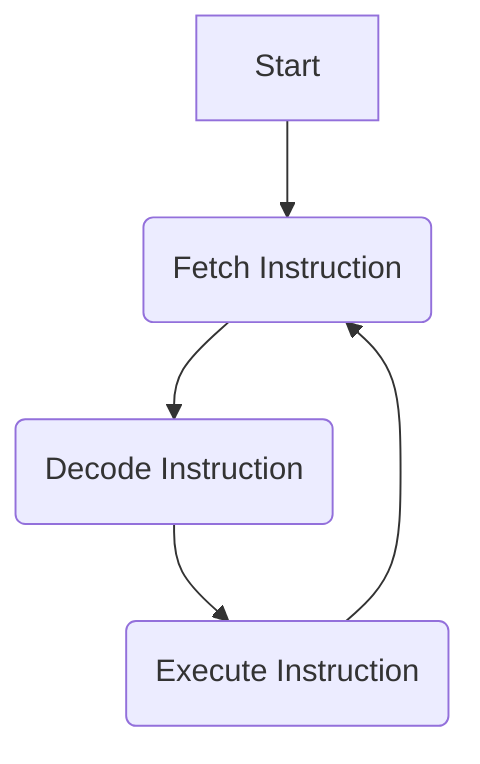
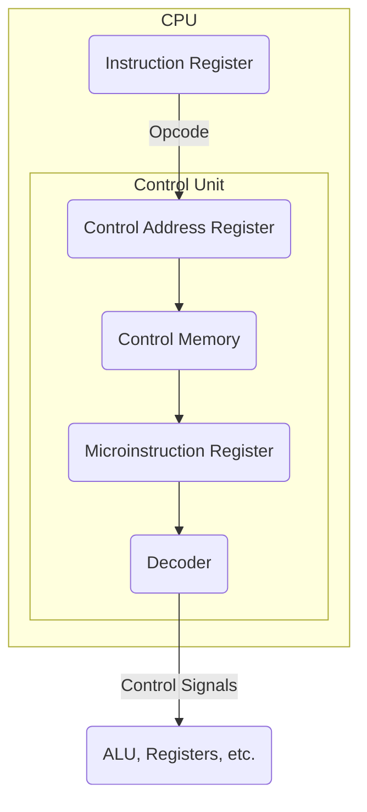
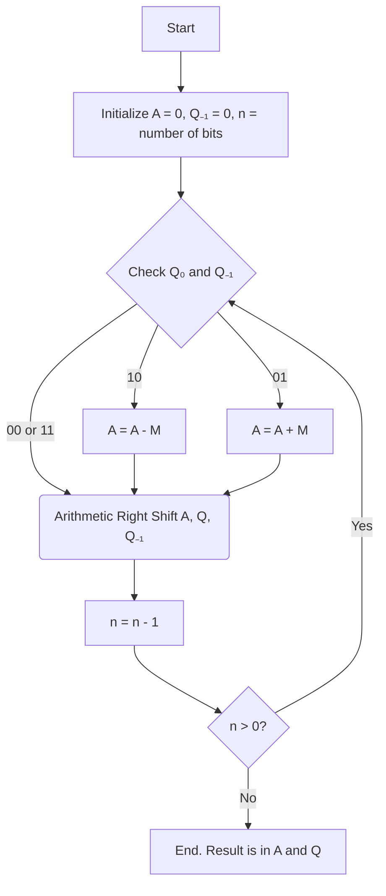
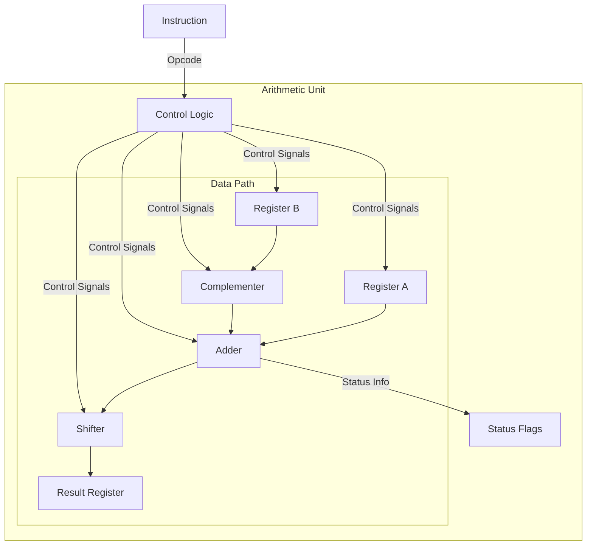
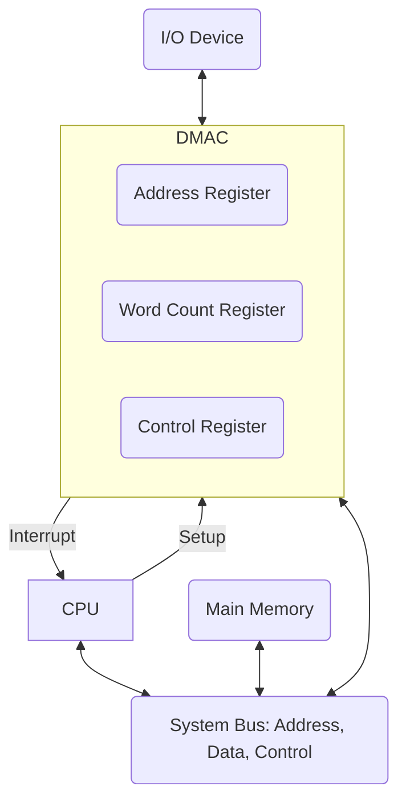

**1.**  
a) Differentiate between accumulator, index, stack and general-purpose registers in terms of their functions and usage.  
b) Discuss the sequence of steps involved in fetching an instruction from memory and executing it.

**2.**  
a) Describe how micro instructions are arranged in control memory and how they are interpreted?  
b) Draw the flowchart for Booth’s algorithm for multiplication of single 2’s complement numbers and explain with an example?

**3.**  
a) Describe the basic arithmetic operations supported by floating-point arithmetic, including addition, subtraction, multiplication and division.  
b) What components are required to design the arithmetic unit; explain with neat sketch?

**4.**  
a) Discuss the fundamental differences between serial and parallel data transfer methods in terms of data transmission, speed and implementation complexity.  
b) What is direct memory transfer? Give an overview and block diagram of a DMA controller?

**5.**  
a) Differentiate synchronous and asynchronous data transfer?  
b) Explain the concept of memory hierarchy and its significance in modern computer systems.

**6.**  
a) Compare and contrast different cache mapping techniques, including direct mapping, set-associative mapping and fully associative mapping. Discuss the advantages and disadvantages of each mapping technique.  
b) Explain the concept of memory segmentation and how it complements virtual memory. Discuss the advantages and challenges of using segmentation in memory management.

**7.**  
a) Describe different types of interconnection networks used in multiprocessor systems.  
b) Define array processing and explain its significance in computer architecture and parallel computing.

**8.**  
Write a short note on any two of the following:  
a) Instruction types  
b) PCI bus  
c) Read Only Memory  
d) Inter-processor communication and synchronization

---

### **Solutions**

**1.**  
**a) Differentiate between accumulator, index, stack and general-purpose registers in terms of their functions and usage.**

| Register Type             | Function                                                                                                  | Usage                                                                                                                                                             |
| ------------------------- | --------------------------------------------------------------------------------------------------------- | ----------------------------------------------------------------------------------------------------------------------------------------------------------------- |
| **Accumulator (AC)**        | A special-purpose register that holds an operand, intermediate results, and the final result of arithmetic and logic operations. | In many early computers, it was the default register for ALU operations. For example, `ADD X` would mean `AC = AC + [X]`.                                     |
| **Index Register (IX)**     | Holds an offset value which is added to a base address in an instruction to form the final "effective" address of the data. | Extremely useful for accessing elements in an array or list. By simply incrementing the index register in a loop, you can process a sequence of data easily. |
| **Stack Pointer (SP)**      | Holds the memory address of the top-most element of the stack. The stack is a LIFO (Last-In, First-Out) data structure. | Crucial for managing function calls (storing return addresses and local variables) and handling interrupts. It's automatically updated during PUSH and POP operations. |
| **General-Purpose (GPR)** | A register that has no specific, pre-defined function. It can be used by the programmer or compiler as needed. | Can store data, memory addresses, or intermediate results. Modern CPUs have many GPRs, providing flexibility and speed. For instance, `ADD R1, R2, R3` adds contents of R2 and R3 and stores the result in R1. |

**b) Discuss the sequence of steps involved in fetching an instruction from memory and executing it.**

This sequence is known as the **Instruction Cycle**. It's the fundamental process by which a computer executes a single machine instruction. The cycle consists of several main steps:

1.  **Instruction Fetch (IF):**
    *   The address of the next instruction is stored in the **Program Counter (PC)**.
    *   The CPU copies the PC's value into the **Memory Address Register (MAR)**.
    *   The CPU sends a read signal to memory. Memory retrieves the instruction and places it on the **Data Bus**.
    *   The instruction is copied from the data bus into the **Memory Data Register (MDR)**, and then into the **Instruction Register (IR)**.
    *   The **PC is incremented** to point to the next instruction, preparing for the next cycle.

2.  **Instruction Decode (ID):**
    *   The **Control Unit (CU)** interprets the opcode (the part of the instruction that specifies the operation) stored in the **IR**.
    *   The CU determines what actions need to be performed.

3.  **Operand Fetch (or Address Calculation):**
    *   If the instruction requires data from memory, the CU calculates the data's address (this is called the effective address) and fetches it into a CPU register.

4.  **Execute (EX):**
    *   The CU sends control signals to the appropriate hardware components (like the **ALU**) to perform the decoded operation. For example, for an `ADD` instruction, the ALU would perform addition on the specified operands.

5.  **Store Result (Write Back):**
    *   The result of the execution is stored, either in a CPU register or written back to main memory.

This cycle repeats continuously as long as the computer is running.



**2.**
**a) Describe how micro instructions are arranged in control memory and how they are interpreted?**

A **microprogrammed control unit** is a way of implementing the CPU's Control Unit (CU). Instead of being built from fixed logic gates, its logic is stored in a special, fast memory called **Control Memory** (or Control Store).

*   **Arrangement in Control Memory:**
    *   The control signals required to execute a single machine instruction (like `LOAD`, `ADD`, `STORE`) are stored as a sequence of **microinstructions**.
    *   Each microinstruction is a bit-string where different bits correspond to different control signals (e.g., `Enable_Register_A`, `ALU_Subtract`, `Memory_Read`).
    *   The sequence of microinstructions for a single machine instruction is called a **microroutine**.
    *   When a machine instruction is decoded, its opcode is used as an address (or part of an address) to find the starting point of its corresponding microroutine in the Control Memory.

*   **Interpretation and Execution:**
    1.  When a machine instruction enters the IR, its opcode points to the start of a microroutine in Control Memory. This address is loaded into the **Control Address Register (CAR)**.
    2.  The microinstruction at the address in the CAR is fetched into the **Microinstruction Register (MIR)**.
    3.  The bits of the MIR are decoded. Each bit (or group of bits) generates a control signal that activates a specific part of the CPU (e.g., tells the ALU to add, opens a data path between two registers).
    4.  The current microinstruction also specifies the address of the *next* microinstruction in the routine, which is then loaded into the CAR. This can be a simple "next in sequence" or a conditional branch based on CPU flags (like the Zero flag).
    5.  This process repeats, executing one microinstruction at a time, until the entire microroutine for the machine instruction is complete. Then, the CU fetches the next machine instruction.



**b) Draw the flowchart for Booth’s algorithm for multiplication of signed 2’s complement numbers and explain with an example?**

Booth's algorithm is an efficient method for multiplying two signed binary numbers. It works by inspecting pairs of bits in the multiplier.

**Variables:**
*   `M`: Multiplicand
*   `Q`: Multiplier
*   `A`: Accumulator (starts at 0)
*   `Q₋₁`: An extra bit, placed to the right of Q (starts at 0)
*   `n`: The number of bits in the multiplier

**Flowchart:**


**Example: Multiply (-3) x (5)** using 4 bits.

*   `M` (Multiplicand) = `5` = `0101`
*   `-M` = `-5` = `1011` (2's Complement of 0101)
*   `Q` (Multiplier) = `-3` = `1101`

**Steps:**

| n | A    | Q    | Q₋₁ | Q₀Q₋₁ | Operation                 |
|:-:|:----:|:----:|:---:|:-----:|:--------------------------|
| 4 | 0000 | 1101 | 0   | **10**  | `A = A - M` (A = 0000 + 1011) |
|   | 1011 | 1101 | 0   |       | Arithmetic Right Shift    |
|   | 1101 | 1110 | 1   |       |                           |
| 3 | 1101 | 1110 | 1   | **01**  | `A = A + M` (A = 1101 + 0101) |
|   | 0010 | 1110 | 1   |       | Arithmetic Right Shift    |
|   | 0001 | 0111 | 0   |       |                           |
| 2 | 0001 | 0111 | 0   | **10**  | `A = A - M` (A = 0001 + 1011) |
|   | 1100 | 0111 | 0   |       | Arithmetic Right Shift    |
|   | 1110 | 0011 | 1   |       |                           |
| 1 | 1110 | 0011 | 1   | **11**  | No operation              |
|   | 1111 | 0001 | 1   |       | Arithmetic Right Shift    |
| 0 |      |      |     |       |                           |

**Result:** The final result is in `A` and `Q`: `1111 0001`.
This 8-bit number is the 2's complement representation of **-15**. (5 * -3 = -15). The algorithm is correct.

**3.**
**a) Describe the basic arithmetic operations supported by floating-point arithmetic, including addition, subtraction, multiplication and division.**

Floating-point numbers (like `1.23 x 10^4`) allow computers to work with a very wide range of real numbers. A number is represented by a **mantissa** (the significant digits) and an **exponent**.

*   **Addition and Subtraction:**
    1.  **Compare Exponents:** The exponents of the two numbers are compared.
    2.  **Align Mantissas:** The mantissa of the number with the *smaller* exponent is shifted to the right. Each shift increases its exponent by 1. This continues until the exponents of both numbers are equal.
    3.  **Add/Subtract Mantissas:** The aligned mantissas are now added or subtracted.
    4.  **Normalize the Result:** The result might not be in the standard format (e.g., it might be `0.0123 x 10^5`). It's shifted left or right until there is one non-zero digit before the decimal point. The exponent is adjusted accordingly. For example, `0.0123 x 10^5` becomes `1.23 x 10^3`.

*   **Multiplication:**
    1.  **Add Exponents:** The exponents of the two numbers are added together (`E_result = E1 + E2`). A bias is often subtracted from the sum.
    2.  **Multiply Mantissas:** The mantissas are multiplied like regular numbers (`M_result = M1 * M2`).
    3.  **Normalize the Result:** The resulting mantissa is normalized, and the exponent is adjusted if necessary.

*   **Division:**
    1.  **Subtract Exponents:** The exponent of the divisor is subtracted from the exponent of the dividend (`E_result = E1 - E2`). A bias is often added to the result.
    2.  **Divide Mantissas:** The mantissa of the dividend is divided by the mantissa of the divisor (`M_result = M1 / M2`).
    3.  **Normalize the Result:** The result is normalized.

**b) What components are required to design the arithmetic unit; explain with neat sketch?**

An **Arithmetic Unit** is the part of the ALU (Arithmetic Logic Unit) responsible for performing arithmetic calculations like addition, subtraction, and shifting.

**Required Components:**
1.  **Registers:** To temporarily store the input operands (data) and the output (result). Examples include the Accumulator and General-Purpose Registers.
2.  **Parallel Adder:** This is the core of the unit. It's an electronic circuit, built from simpler 'Full Adder' circuits, that can add two binary numbers of a certain bit-length (e.g., 32-bit or 64-bit) simultaneously.
3.  **Complementer:** A logic circuit used to perform subtraction. Subtraction (`A - B`) is achieved by adding the 2's complement of B to A (`A + (-B)`). The complementer creates the 2's complement of an operand.
4.  **Shifter:** A circuit that can shift the bits of a number to the left or right. This is essential for aligning mantissas in floating-point operations and is also used in multiplication and division algorithms.
5.  **Control Logic:** This circuitry interprets the opcode from the instruction and generates the necessary control signals to select the correct operation (e.g., 'add', 'subtract', 'shift') and direct the flow of data between the registers and the adder/shifter.
6.  **Status Flags:** A set of flip-flops that store information about the result of the last operation, such as whether the result was zero (Zero Flag), if there was a carry-out (Carry Flag), or if the result was negative (Sign Flag).

**Sketch of a simple Arithmetic Unit:**


**4.**
**a) Discuss the fundamental differences between serial and parallel data transfer methods in terms of data transmission, speed and implementation complexity.**

| Feature                 | Serial Transfer                                                              | Parallel Transfer                                                                 |
| ----------------------- | ---------------------------------------------------------------------------- | --------------------------------------------------------------------------------- |
| **Data Transmission**   | Bits of a data word are sent one after another over a **single wire** or channel. | All bits of a data word are sent simultaneously, each on its **own dedicated wire**. |
| **Speed**               | **Slower**. Only one bit can be transferred per clock cycle.                     | **Faster** (in theory). An entire word (e.g., 8 bits) is transferred in one clock cycle. |
| **Implementation**      | **Simple and Cheap**. Requires only one data line, making cables thinner and connectors smaller. It's ideal for long distances. | **Complex and Expensive**. Requires multiple wires, leading to thicker cables and larger connectors. More prone to "skew" (bits arriving at different times) over long distances. |
| **Examples**            | USB, SATA, Ethernet, Serial Ports (RS-232).                                | Older printer ports (Centronics), PATA (IDE) hard drive cables, internal CPU buses. |

**b) What is direct memory transfer? Give an overview and block diagram of a DMA controller?**

**Direct Memory Access (DMA)** is a feature that allows certain hardware subsystems (like disk drives, network cards, and graphics cards) to access main memory (RAM) directly, **without involving the CPU**.

**Overview:**
Normally, for an I/O device to transfer data to or from memory, it has to go through the CPU. The CPU would read a piece of data from the I/O device into a register, and then write that data to memory. This is slow and keeps the CPU busy with simple data-shuffling tasks.

DMA offloads this work. The I/O device uses a special-purpose processor called a **DMA Controller (DMAC)**. To transfer a block of data, the CPU just gives the DMAC four pieces of information:
1.  The address of the I/O device.
2.  The starting address in memory for the data transfer.
3.  The number of words (or bytes) to transfer.
4.  The direction of the transfer (read from I/O or write to I/O).

After this, the CPU is free to do other work. The DMAC takes control of the system bus and manages the entire data transfer between the I/O device and memory. When the transfer is complete, the DMAC sends an interrupt signal to the CPU to let it know the job is done.

**Block Diagram of a DMA Controller:**

*   **Address Register:** Stores the memory address to be used for the transfer. It's automatically incremented after each word transfer.
*   **Word Count Register:** Stores the number of words to be transferred. It's automatically decremented after each word transfer.
*   **Control Register:** Specifies the mode of transfer (read/write), I/O device address, etc.

**5.**
**a) Differentiate synchronous and asynchronous data transfer?**

| Feature           | Synchronous Data Transfer                                                                                              | Asynchronous Data Transfer                                                                                                 |
| ----------------- | ---------------------------------------------------------------------------------------------------------------------- | -------------------------------------------------------------------------------------------------------------------------- |
| **Timing**        | The transfer of data is governed by a **common clock signal**, shared by both the sender (master) and the receiver (slave). | The transfer of data is **not governed by a common clock**. The timing is coordinated using special control signals.     |
| **Mechanism**     | Events (when to read/write data on the bus) happen at specific points in time, defined by the rising or falling edge of the clock. | A **handshaking** protocol is used. The sender sends a "data ready" signal, and the receiver replies with a "data acknowledged" signal. |
| **Speed**         | Generally **faster and simpler** for short distances, as there's no overhead from handshaking signals for each data item. | Can be **slower** due to the overhead of the handshaking protocol for every piece of data transferred.                       |
| **Flexibility**   | Less flexible. Both devices must be synchronized to the same clock, which can be difficult over long distances.      | **More flexible**. It can be used between devices that operate at different speeds. It is reliable over long distances. |
| **Example Usage** | Internal CPU buses, communication between CPU and memory (e.g., SDRAM).                                                 | Communication with peripherals like keyboards, printers (USB, RS-232), and some I/O devices.                               |

**b) Explain the concept of memory hierarchy and its significance in modern computer systems.**

The **Memory Hierarchy** is a structure that organizes computer storage into a "pyramid" of levels. The goal is to create a memory system that is large, fast, and affordable by combining different types of memory technologies.

**The Levels of the Hierarchy:**

```mermaid
graph TD
    A(CPU Registers)
    B(L1 Cache)
    C(L2 Cache)
    D(L3 Cache)
    E(Main Memory - RAM)
    F(Secondary Storage - SSD/HDD)
    G(Tertiary Storage - Tape)

    A <--> B <--> C <--> D <--> E <--> F <--> G

    subgraph ""
        direction TB
        Top(Top Level) -- "Faster Access Time<br>Higher Cost per Bit<br>Smaller Capacity" --> Bottom(Bottom Level)
    end
```

*   **Top Level (CPU Registers, Cache):** Extremely fast, very expensive per bit, and small in size. They are located inside or very close to the CPU.
*   **Middle Level (Main Memory/RAM):** Slower than cache, cheaper, and much larger. This is the main working area of the computer.
*   **Bottom Level (Secondary/Tertiary Storage):** Slowest, cheapest per bit, and vast in size (e.g., Hard Drives, SSDs, Tape Drives). Used for long-term storage.

**Significance and Why It Works:**

The memory hierarchy is significant because it provides the illusion of a memory that is both **very fast** and **very large**, without the prohibitive cost of building the entire memory out of the fastest technology.

It works because of a principle called the **Locality of Reference**, which has two forms:
1.  **Temporal Locality:** If a program accesses a piece of data, it is very likely to access that same piece of data again soon.
2.  **Spatial Locality:** If a program accesses a piece of data, it is very likely to access data at nearby memory locations soon (e.g., the next element in an array).

Because of locality, when the CPU needs data, a block of it is copied from a slower, larger level (like RAM) to a faster, smaller level (like Cache). Since the CPU is likely to need that data (temporal) and nearby data (spatial) again soon, it can get it from the fast cache instead of going all the way back to slow RAM. This dramatically improves system performance.

**6.**
**a) Compare and contrast different cache mapping techniques, including direct mapping, set-associative mapping and fully associative mapping.**

Cache mapping techniques determine how a block of data from main memory is placed into the cache.

| Feature             | Direct Mapping                                                                       | Fully Associative Mapping                                                     | N-Way Set-Associative Mapping                                                      |
| ------------------- | ------------------------------------------------------------------------------------ | ----------------------------------------------------------------------------- | ---------------------------------------------------------------------------------- |
| **How it Works**    | Each memory block can only be mapped to **one specific line** in the cache. `(Cache Line = Memory Block Address % Number of Cache Lines)` | A memory block can be placed in **any available line** in the cache.          | A compromise. The cache is divided into sets, and a memory block can be placed in **any line within a specific set**. `(Set Number = Memory Block Address % Number of Sets)` |
| **Hardware Cost**   | **Cheapest and simplest** to implement.                                              | **Most expensive and complex**. Requires a lot of comparison hardware.        | **Moderate cost and complexity**, depending on the "N-way" (the number of lines per set). |
| **Search Speed**    | **Fastest**. The cache only needs to check one location to see if the data is present. | **Slowest**. The cache must check every single line simultaneously to find the data. | **Fast**. The cache only needs to check the 'N' lines within one set.           |
| **Conflict Misses** | **High**. If a program frequently accesses two memory blocks that map to the same cache line, they will constantly kick each other out, causing many misses. | **None**. Conflict misses are eliminated because a block can go anywhere.      | **Low to Moderate**. Reduces conflict misses compared to direct mapping because there are 'N' choices for placement within a set. |
| **Usage**           | Used in very simple or low-cost caches.                                              | Rarely used for main CPU caches due to cost, but used in other places like the Translation Lookaside Buffer (TLB). | **The most common method** used in modern CPU caches (L1, L2, L3) as it provides a good balance of performance and cost. |

**b) Explain the concept of memory segmentation and how it complements virtual memory.**

**Memory Segmentation:**
Memory segmentation is a memory management technique where the memory is divided into variable-sized blocks called **segments**. Unlike paging (which uses fixed-size blocks), each segment corresponds to a logical unit of a program, such as:
*   A code segment (for executable instructions)
*   A data segment (for variables)
*   A stack segment (for function calls)
*   A symbol table or other program-defined unit

A logical address in a segmented system consists of two parts: a **segment number** and an **offset** within that segment. The system uses a **Segment Table** to translate this logical address into a physical memory address.

**Advantages of Segmentation:**
*   **Logical Grouping:** It aligns with how programmers think about their programs (code, data, stack).
*   **Protection and Sharing:** It's easy to apply different protection rules (e.g., read-only for code, read/write for data) or to share entire segments (like a code library) between different programs.
*   **No Internal Fragmentation:** Since segments are sized to fit the logical unit, no space is wasted *inside* a segment. (However, it can suffer from external fragmentation).

**How it Complements Virtual Memory:**
Virtual memory is a technique that gives a program the illusion that it has a very large, private, contiguous memory space, when in reality its parts may be scattered in physical RAM or stored on disk.

Segmentation and paging (the most common virtual memory technique) can be combined to get the benefits of both:
1.  **Logical Structure (from Segmentation):** A program's address space is first divided into logical segments (code, data, stack). This provides a meaningful structure and allows for easy sharing and protection.
2.  **Flexibility and Efficiency (from Paging):** Each of these variable-sized segments is then further divided into fixed-size **pages**.
    *   This solves the external fragmentation problem of pure segmentation, as any free page frame in physical memory can be used for any page from any segment.
    *   It allows for fine-grained memory management. Instead of loading an entire large segment into memory, the system only needs to load the specific pages of that segment that are currently being used.

In a combined system (like in modern x86 processors), a logical address is made of `(segment, page, offset)`. The system first uses the segment number to find the page table for that segment, and then uses the page number to find the physical frame in memory. This combination provides both logical organization and efficient physical memory management.

**7.**
**a) Describe different types of interconnection networks used in multiprocessor systems.**

Interconnection networks are the "fabric" that connects processors and memory modules in a multiprocessor system. They can be classified based on their topology.

1.  **Shared Bus:**
    *   **Description:** All processors and memory modules share a single common communication path (the bus).
    *   **Pros:** Simple and low-cost.
    *   **Cons:** Becomes a bottleneck. Only one processor can use the bus at a time. Not scalable to a large number of processors.
    *   **Diagram:** `[P1]--[P2]--[P3]--[M1]--[M2]` (all connected to a single line).

2.  **Crossbar Switch:**
    *   **Description:** A non-blocking network with a dedicated switch at the intersection of every processor and memory module.
    *   **Pros:** Allows simultaneous communication between different processors and memory modules as long as they are trying to access different destinations. Provides maximum bandwidth.
    *   **Cons:** Very expensive and complex. The number of switches grows with the square of the number of components (`N x M` switches).
    *   **Diagram:** A grid with processors on one axis, memory on the other, and a switch at each intersection.

3.  **Multistage Networks (e.g., Omega Network):**
    *   **Description:** A compromise between a shared bus and a crossbar. It uses several stages of smaller switches (often 2x2 switches) to connect inputs to outputs.
    *   **Pros:** More scalable and cheaper than a full crossbar.
    *   **Cons:** Can be blocking (multiple paths may contend for the same switch). More complex than a simple bus.
    *   **Diagram:** Multiple columns of 2x2 switches connecting an input stage to an output stage.

4.  **Static/Direct Networks (Used in distributed-memory systems):**
    *   In these networks, each processor has a direct point-to-point link to a specific set of "neighbor" processors.
    *   **Linear Array/Ring:** Processors are connected in a line or a circle. Simple, but communication between distant nodes is slow.
    *   **Mesh/Torus:** Processors are arranged in a 2D or 3D grid. A Torus is a mesh where the edges wrap around. Good for scientific applications with local communication patterns.
    *   **Hypercube:** A highly connected network where N processors are arranged as the vertices of an n-dimensional cube (`N = 2^n`). Provides low latency and many alternative paths, but the number of connections per node grows with the size of the network.

**b) Define array processing and explain its significance in computer architecture and parallel computing.**

**Definition:**
**Array processing** refers to the use of a single processor (or a set of synchronized processors) to perform the same operation simultaneously on multiple elements of a large data set, typically an array or vector. This is a form of parallel processing known as **SIMD (Single Instruction, Multiple Data)**.

An array processor contains a set of identical **Processing Elements (PEs)**, each with its own local memory, all operating in lockstep under the command of a single control unit. The control unit fetches and decodes an instruction, and then broadcasts that single instruction to all PEs, which execute it on their own piece of data.

**Significance:**
Array processing is highly significant for tasks that are "data-parallel"—that is, problems that involve performing the same calculation over and over again on large arrays of numbers. Its importance lies in:

1.  **Massive Performance Gains:** For suitable problems, array processors provide enormous speedups over traditional scalar (one-data-item-at-a-time) processors. Instead of a loop that runs 1000 times to process an array, an array processor with 1000 PEs could theoretically do it in a single step.

2.  **Scientific and Engineering Computing:** It is fundamental to high-performance computing (HPC). Many critical scientific simulations rely on vector and matrix operations, such as:
    *   Weather forecasting
    *   Computational fluid dynamics (e.g., designing aircraft)
    *   Finite element analysis (e.g., structural engineering)
    *   Physics simulations

3.  **Graphics and Image Processing:** Modern **Graphics Processing Units (GPUs)** are a prime example of array processors. Rendering 3D graphics, applying filters to images, or processing video involves applying the same mathematical operations to millions of pixels or vertices simultaneously.

4.  **Signal Processing:** Real-time processing of signals (audio, radar, sonar) often involves applying mathematical transforms (like the Fast Fourier Transform) to large streams of data, a task perfectly suited for array processors.

5.  **Artificial Intelligence and Machine Learning:** Training neural networks involves massive matrix multiplications and vector operations. GPUs (acting as array processors) are the standard hardware for accelerating these tasks, making modern deep learning feasible.

In summary, array processing provides the architectural foundation for solving some of the most computationally demanding problems in science, engineering, and AI by efficiently exploiting data-level parallelism.

**8.**
**Write a short note on any two of the following:**
**a) Instruction Types**

Instructions are the commands given to a CPU. They can be broadly classified into three main types based on their function:

1.  **Data Transfer Instructions:** These instructions move data between different locations in the computer without changing the data itself. They are the most common type of instruction.
    *   **Examples:**
        *   `LOAD`: Copy data from memory into a CPU register.
        *   `STORE`: Copy data from a CPU register into memory.
        *   `MOVE`: Copy data from one register to another.
        *   `PUSH`/`POP`: Add/remove data from the stack.
        *   `IN`/`OUT`: Transfer data to/from an I/O device.

2.  **Data Processing Instructions:** These instructions perform arithmetic or logical operations on data.
    *   **Arithmetic Examples:** `ADD`, `SUBTRACT`, `MULTIPLY`, `DIVIDE`, `INCREMENT`, `DECREMENT`.
    *   **Logical Examples:** `AND`, `OR`, `XOR`, `NOT`, `SHIFT`, `ROTATE`. These operate on data at the bit level.

3.  **Program Control Instructions:** These instructions change the flow of program execution. Normally, the CPU executes instructions sequentially. Control instructions allow for decision-making, loops, and function calls.
    *   **Examples:**
        *   `BRANCH`/`JUMP`: Unconditionally jump to a different part of the program.
        *   `Conditional Branch`: Jump only if a certain condition is true (e.g., `BEQ` - Branch if Equal, checks the Zero Flag).
        *   `CALL`: Jump to a subroutine (function) and save the return address.
        *   `RETURN`: Go back to the instruction after the original `CALL`.
        *   `HALT`: Stop program execution.

---
**c) Read Only Memory**

**Read-Only Memory (ROM)** is a type of non-volatile computer memory, meaning it retains its contents even when the power is turned off. As the name implies, data stored in ROM is either impossible or very difficult to modify after it has been manufactured.

**Key Characteristics:**
*   **Non-Volatile:** Data is permanent and is not lost when power is removed. This makes it ideal for storing firmware.
*   **Read-Only:** In traditional ROM, data is written once during the manufacturing process and cannot be changed.
*   **Firmware Storage:** Its primary use is to store **firmware**—low-level software that is tightly coupled with specific hardware. The most common example is the **BIOS** (Basic Input/Output System) or **UEFI** (Unified Extensible Firmware Interface) on a computer's motherboard. This firmware contains the initial code needed to boot the computer, test hardware, and load the operating system from a hard drive.
*   **Embedded Systems:** ROM is extensively used in embedded systems (like in a microwave oven, washing machine, or a car's engine control unit) to store the device's operating program.

**Types of ROM:**
While classic ROM is written at the factory, several variants have been developed to provide more flexibility:
*   **PROM (Programmable ROM):** Can be written to (programmed) exactly once by a user with a special tool.
*   **EPROM (Erasable Programmable ROM):** Can be erased by exposing it to strong ultraviolet light and then reprogrammed.
*   **EEPROM (Electrically Erasable Programmable ROM):** Can be erased and reprogrammed electrically, without removing it from the circuit. This is much more convenient.
*   **Flash Memory:** A modern, faster type of EEPROM. It is the technology used in SSDs, USB flash drives, and memory cards. It allows for erasing and writing in blocks, making it very versatile.
